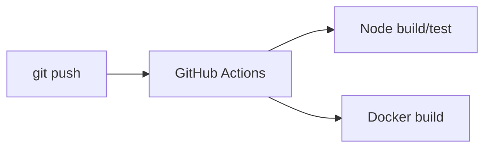
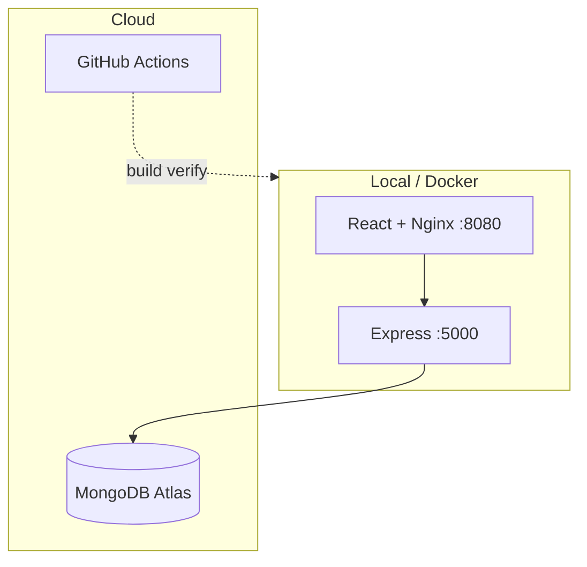

# DevOps Internship — MERN Task Manager

**Repo:** https://github.com/ismail-at-git/devops-internship-project

JWT task app: React · Express · MongoDB Atlas · Docker · GitHub Actions CI.

## Layout

```
backend/   frontend/   docker-compose.yml
deploy/    scripts/    .github/workflows/ci.yml
```

## Local dev

```bash
cd backend && npm install && npm run dev
cd frontend && npm install && npm start
```

API `http://localhost:5001` · UI `http://localhost:3000`

## Environment

| File | Key vars |
|------|----------|
| `backend/.env` | `MONGO_URI`, `JWT_SECRET`, `PORT` |
| `frontend/.env` | `REACT_APP_API_URL=http://localhost:5001` |

Never commit `.env`.

---

## Docker

**Prerequisites:** Docker Desktop running · `backend/.env` · Atlas Network Access (your IP or `0.0.0.0/0` for dev)

```bash
docker compose down
docker compose build
docker compose up -d
docker compose ps
docker compose logs backend -f
docker compose down
```

| URL | Use |
|-----|-----|
| http://localhost:8080 | UI + `/api/*` (Nginx) |
| http://localhost:8080/health | Health via proxy |
| http://localhost:5000 | API direct |

Docker build uses empty `REACT_APP_API_URL` (same-origin `/api`).

### Verification status

| Check | Status |
|-------|--------|
| `docker compose build` | Verified |
| Backend healthy + Atlas | Verified |
| Frontend healthy + Nginx | Verified |
| Register / login / JWT / task CRUD | Verified (`scripts/test-docker-api.ps1`) |

```powershell
.\scripts\test-docker-api.ps1
```

### Troubleshooting

- **Backend unhealthy** → Atlas Network Access → add IP → `docker compose restart backend`
- **Frontend waits on backend** → fix Mongo first
- **Slow build** → `.dockerignore` excludes `node_modules`

---

## CI/CD (Phase 4)

**GitHub Actions** — `.github/workflows/ci.yml`

Runs on **push** and **pull_request** to `master` / `main`:

1. Verify project structure  
2. `npm ci` + syntax check (backend)  
3. `npm run build` (frontend)  
4. `docker compose build`

Local same checks:

```bash
chmod +x scripts/ci-verify.sh && ./scripts/ci-verify.sh
```

View runs: GitHub → **Actions** tab.



---

## EC2 deploy (Phase 3)

Ubuntu EC2 · SG ports **22**, **8080** · Atlas allows EC2 IP

```bash
ssh -i key.pem ubuntu@<EC2_IP>
git clone https://github.com/ismail-at-git/devops-internship-project.git
cd devops-internship-project
cp backend/.env.example backend/.env   # edit secrets
chmod +x deploy/ec2-setup.sh && ./deploy/ec2-setup.sh
```

App: `http://<EC2_IP>:8080`

---

## Progress

| Phase | Status |
|-------|--------|
| Phase 1 — env / structure | Done |
| Phase 2 — Docker | Done (verified) |
| Phase 3 — EC2 scripts | Ready (manual deploy) |
| Phase 4 — GitHub Actions CI | Done |

---

## Architecture


