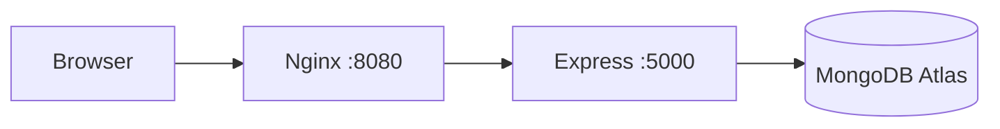

# DevOps Internship — MERN Task Manager

JWT-authenticated task management: React 18, Express, MongoDB Atlas.

**Repo:** https://github.com/ismail-at-git/devops-internship-project

## Tech stack

React · Express · Mongoose · JWT · MongoDB Atlas · Docker · Nginx · AWS EC2 (Phase 3)

## Layout

```
backend/          API + Dockerfile
frontend/         React + Nginx Dockerfile
docker-compose.yml
deploy/ec2-setup.sh
scripts/test-docker-api.ps1
```

## Local dev (no Docker)

```bash
cd backend && npm install && npm run dev
cd frontend && npm install && npm start
```

API `http://localhost:5001` · UI `http://localhost:3000`

## Environment

| File | Variables |
|------|-----------|
| `backend/.env` | `MONGO_URI`, `JWT_SECRET`, `PORT` (5001 local), `CLIENT_URL` |
| `frontend/.env` | `REACT_APP_API_URL=http://localhost:5001` |

Copy from `*.env.example`. Never commit `.env`.

---

## Docker

### Prerequisites

- Docker Desktop running (Linux engine)
- `backend/.env` with valid Atlas `MONGO_URI`
- **Atlas → Network Access:** add your public IP or `0.0.0.0/0` (dev only)

### Commands

```bash
docker compose build
docker compose up -d
docker compose ps
docker compose logs backend -f
docker compose down
```

| URL | Purpose |
|-----|---------|
| http://localhost:8080 | UI + `/api/*` via Nginx |
| http://localhost:8080/health | Health (proxied) |
| http://localhost:5000 | API direct |

Docker uses empty `REACT_APP_API_URL` so the browser calls same-origin `/api/...`.

### Verification status

| Check | Status |
|-------|--------|
| `docker compose build` | Verified |
| Backend image / container start | Verified |
| Frontend image build | Verified |
| Atlas from containers | **Requires Atlas IP allowlist** (see troubleshooting) |
| Full auth + CRUD in Docker | Run `scripts/test-docker-api.ps1` after Atlas allows your IP |

### Troubleshooting

1. **Backend unhealthy / MongoDB IP not whitelisted**  
   Atlas → Network Access → Add IP → `0.0.0.0/0` (dev) or your current IP → wait 1–2 min → `docker compose restart backend`.

2. **Frontend not starting**  
   Waits for healthy backend. Fix Mongo first.

3. **`docker compose config` prints secrets** — do not share output.

4. **Slow builds** — `.dockerignore` excludes `node_modules`; rebuild after pull.

### Quick API test (PowerShell)

```powershell
.\scripts\test-docker-api.ps1
```

---

## Phase 3 — AWS EC2 (simple Docker Compose deploy)

### Prerequisites

- Ubuntu 22.04 EC2 (t2.micro+)
- Security group: **22** (SSH), **8080** (app), optional **5000** (API debug)
- PEM key for SSH
- Atlas allows **EC2 public IP** (or `0.0.0.0/0` for dev)

### Steps

1. Launch EC2, connect:
   ```bash
   ssh -i your-key.pem ubuntu@<EC2_PUBLIC_IP>
   ```

2. Clone and configure:
   ```bash
   git clone https://github.com/ismail-at-git/devops-internship-project.git
   cd devops-internship-project
   cp backend/.env.example backend/.env
   nano backend/.env   # set MONGO_URI, JWT_SECRET
   ```

3. Run setup script:
   ```bash
   chmod +x deploy/ec2-setup.sh
   ./deploy/ec2-setup.sh
   ```

4. Open **http://&lt;EC2_PUBLIC_IP&gt;:8080** — register, login, tasks.

5. In Atlas, add EC2 public IP to Network Access if not using `0.0.0.0/0`.

### EC2 env notes

- Compose sets `PORT=5000` and `CLIENT_URL=http://<EC2_IP>:8080` (override in compose or `.env` if needed).
- No Kubernetes/Terraform/CI in this phase.

### Phase 3 completion

| Item | Status |
|------|--------|
| `deploy/ec2-setup.sh` | Ready |
| Live EC2 deploy from this agent | **Not run** — needs your EC2 IP + SSH key on your machine |

---

## Progress

| Phase | Status |
|-------|--------|
| Local MERN + GitHub | Done |
| Phase 1 — env examples | Done |
| Phase 2 — Docker | Build/up verified; runtime needs Atlas IP |
| Phase 3 — EC2 scripts + docs | Ready for you to run on EC2 |

---

## Architecture


