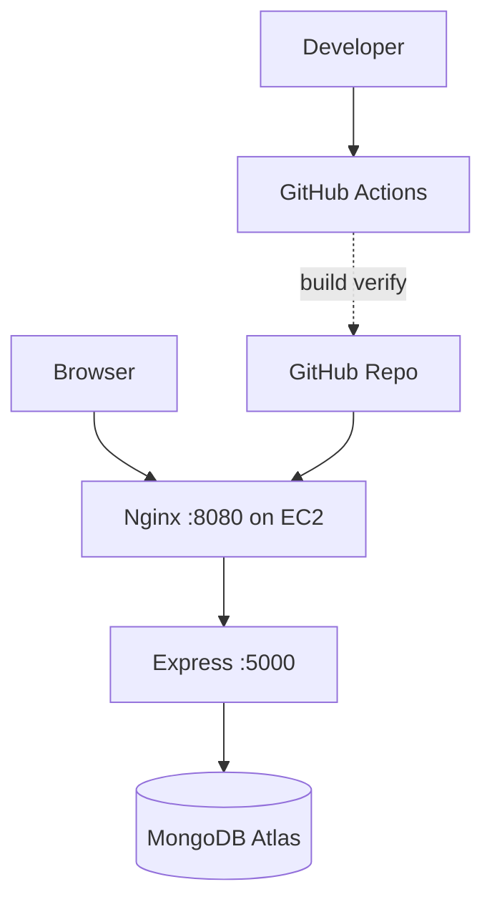

# DevOps Internship — MERN Task Manager

**Repo:** https://github.com/ismail-at-git/devops-internship-project

JWT task app: React · Express · MongoDB Atlas · Docker · GitHub Actions · **AWS EC2**.

## Live deployment

| Item | Value |
|------|--------|
| **URL** | http://13.48.42.252:8080 |
| **Region** | `eu-north-1` |
| **Stack** | Docker Compose on EC2 (t2.micro class) |

Register, login, and manage tasks in the browser at the URL above.

---

## Layout

```
backend/   frontend/   docker-compose.yml
deploy/    scripts/    .github/workflows/ci.yml
```

## Local dev

```bash
cd backend && npm install && npm run dev
cd frontend && npm install && npm start
```

API `http://localhost:5001` · UI `http://localhost:3000`

## Environment

| File | Key vars |
|------|----------|
| `backend/.env` | `MONGO_URI`, `JWT_SECRET`, `PORT` |
| `frontend/.env` | `REACT_APP_API_URL=http://localhost:5001` |

Never commit `.env`.

---

## Docker (local)

```bash
docker compose build
docker compose up -d
```

| URL | Use |
|-----|-----|
| http://localhost:8080 | UI + API (Nginx) |
| http://localhost:5000 | API direct |

```powershell
.\scripts\test-docker-api.ps1
```

**Atlas:** allow your machine IP (or `0.0.0.0/0` for dev).

---

## AWS EC2 deployment (Phase 5)

### Prerequisites (free tier)

- Ubuntu 22.04 EC2
- Security group: **22** (SSH), **8080** (app)
- PEM key for SSH
- Atlas Network Access: **EC2 public IP** (or `0.0.0.0/0` for dev)
- `backend/.env` on the server (not in Git)

### Deploy steps

```bash
# From your PC — copy env (create backend/.env locally first)
scp -i your-key.pem backend/.env ubuntu@<EC2_IP>:/tmp/backend.env

ssh -i your-key.pem ubuntu@<EC2_IP>
git clone https://github.com/ismail-at-git/devops-internship-project.git
cd devops-internship-project
cp /tmp/backend.env backend/.env && chmod 600 backend/.env
export CLIENT_URL=http://<EC2_IP>:8080
chmod +x deploy/ec2-setup.sh && ./deploy/ec2-setup.sh
```

Or use the automated script on EC2 after cloning and placing `backend/.env`.

### Verify public app

```powershell
.\scripts\test-ec2-api.ps1
# or open http://<EC2_IP>:8080
```

### EC2 maintenance

```bash
cd ~/devops-internship-project
git pull origin master
sudo docker compose build
sudo docker compose up -d
sudo docker compose ps
```

---

## CI/CD

GitHub Actions (`.github/workflows/ci.yml`) on push/PR to `master`/`main`:

- Structure check · backend syntax · frontend build · `docker compose build`

```bash
chmod +x scripts/ci-verify.sh && ./scripts/ci-verify.sh
```

---

## Progress

| Phase | Status |
|-------|--------|
| Phase 1 — env / structure | Done |
| Phase 2 — Docker | Done |
| Phase 3 — EC2 scripts | Done |
| Phase 4 — GitHub Actions CI | Done |
| Phase 5 — EC2 live deploy | **Done** |

---

## Architecture


