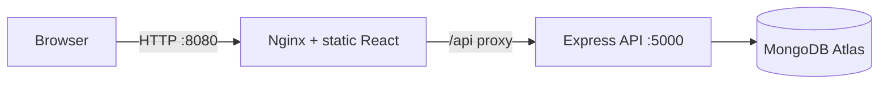

# DevOps Internship — MERN Task Manager

JWT-authenticated task management: React 18 (CRA), Express API, MongoDB Atlas.

## Tech stack

- React, React Router, Axios  
- Node.js, Express, Mongoose, JWT  
- MongoDB Atlas (local dev and Docker use the same `MONGO_URI` pattern)

## Repository layout

```
backend/             Express API
frontend/            React SPA (Nginx in Docker)
docker-compose.yml   Backend + frontend (Atlas; no bundled MongoDB)
```

Legacy `Jenkinsfile` / `.github/workflows` are optional reference only.

## Prerequisites

- Node.js 18+  
- Docker Desktop (Linux engine) running  
- MongoDB Atlas cluster + `backend/.env`  
- Git, GitHub CLI (`gh`) if you push from this machine

## Environment variables

**Backend** — `backend/.env` (from `backend/.env.example`):

| Variable | Description |
|----------|-------------|
| `MONGO_URI` | Atlas connection string |
| `JWT_SECRET` | JWT signing secret |
| `JWT_EXPIRE` | Optional (default `7d`) |
| `PORT` | Local dev default `5001`; Docker sets `5000` via Compose |
| `CLIENT_URL` | Browser origin (e.g. `http://localhost:3000` locally, `http://localhost:8080` with Compose below) |

**Frontend (local only)** — `frontend/.env`: `REACT_APP_API_URL=http://localhost:5001`  
**Frontend (Docker)** — built with empty `REACT_APP_API_URL` so the browser calls `/api/...` on the same host and Nginx proxies to the backend.

## Local development (no Docker)

```bash
cd backend && npm install && npm run dev
cd frontend && npm install && npm start
```

- API: `http://localhost:5001`  
- UI: `http://localhost:3000`

## Docker (Atlas)

1. Start **Docker Desktop**.  
2. Ensure `backend/.env` exists with a valid **`MONGO_URI`** (Atlas must allow traffic from your machine’s public IP, or `0.0.0.0/0` for dev).  
3. From the repository root:

```bash
docker compose build
docker compose up -d
```

- **UI + API (via Nginx):** `http://localhost:8080`  
- **API direct (optional):** `http://localhost:5000`  
- **Health (via Nginx):** `http://localhost:8080/health`  
- **Health (direct API):** `http://localhost:5000/health`

Stop: `docker compose down`

**Note:** `docker compose config` prints resolved environment values — do not share that output if it contains secrets.

## Architecture



## Progress tracker

| Phase | Status | Notes |
|-------|--------|--------|
| Copy / local dev | Done | Use `backend/.env` + Atlas |
| GitHub `devops-internship-project` | Done | |
| Phase 1 — env examples & docs | Done | |
| Phase 2 — Docker (Compose + Nginx + Atlas) | Done | Run `docker compose up` with Docker Desktop; verify register/login/tasks |

**Phase 2+ (AWS/K8s/etc.):** out of scope unless added later.
