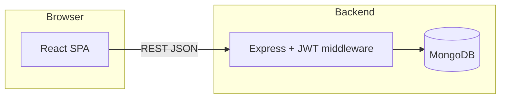

# DevOps Internship — MERN Task Manager

JWT-authenticated task management app: React 18 (CRA), Express API, MongoDB (Atlas for local dev; optional Docker Mongo in compose).

## Tech stack

- React, React Router, Axios  
- Node.js, Express, Mongoose, JWT (`jsonwebtoken`)  
- MongoDB (Atlas or container)

## Repository layout

```
backend/          Express API (server.js, routes, models, middleware)
frontend/         Create React App (src/pages, components, context)
docker-compose.yml   Optional full stack (Mongo + backend + frontend)
```

Legacy CI/CD files (`Jenkinsfile`, `.github/workflows`) remain for reference; this internship track focuses on GitHub + README phases below.

## Prerequisites

- Node.js 18+  
- MongoDB Atlas cluster (or use Docker Compose Mongo service)  
- Git, [GitHub CLI](https://cli.github.com/) (`gh`) for pushes from this machine

## Environment variables

**Backend** — copy `backend/.env.example` to `backend/.env` and set real values:

| Variable     | Description |
|-------------|-------------|
| `MONGO_URI` | MongoDB connection string |
| `JWT_SECRET` | Secret for signing JWTs |
| `PORT`      | API port (default `5001`; must match frontend) |
| `JWT_EXPIRE`| Optional token lifetime (default `7d`) |
| `CLIENT_URL`| Frontend origin (e.g. `http://localhost:3000`) |

**Frontend** — copy `frontend/.env.example` to `frontend/.env`:

| Variable            | Description |
|--------------------|-------------|
| `REACT_APP_API_URL`| Base URL of API (e.g. `http://localhost:5001`) |

## Local development

Terminal 1 — backend:

```bash
cd backend
npm install
npm run dev
```

Terminal 2 — frontend:

```bash
cd frontend
npm install
npm start
```

- API: `http://localhost:5001` (or your `PORT`)  
- UI: `http://localhost:3000`  
- Health: `GET http://localhost:5001/health`

Confirm register, login, and task CRUD in the browser after Atlas **Network Access** allows your IP.

## Architecture (high level)



## Progress tracker

| Phase | Status | Notes |
|-------|--------|--------|
| Copy verified / deps installed | Done | Run full auth + CRUD on your machine (Atlas + `.env`). |
| GitHub repo `devops-internship-project` | Done | Initialized from inner folder; secrets not committed. |
| Phase 1 — env standardization & docs | Done | `.env.example` files, `.gitignore`, this README. |
| Phase 2 — Docker polish & docs | Pending | Requires your go-ahead; Dockerfiles + compose already present. |

---

**Phase 2 not started** — say when to proceed after you confirm free-plan capacity on your side.
